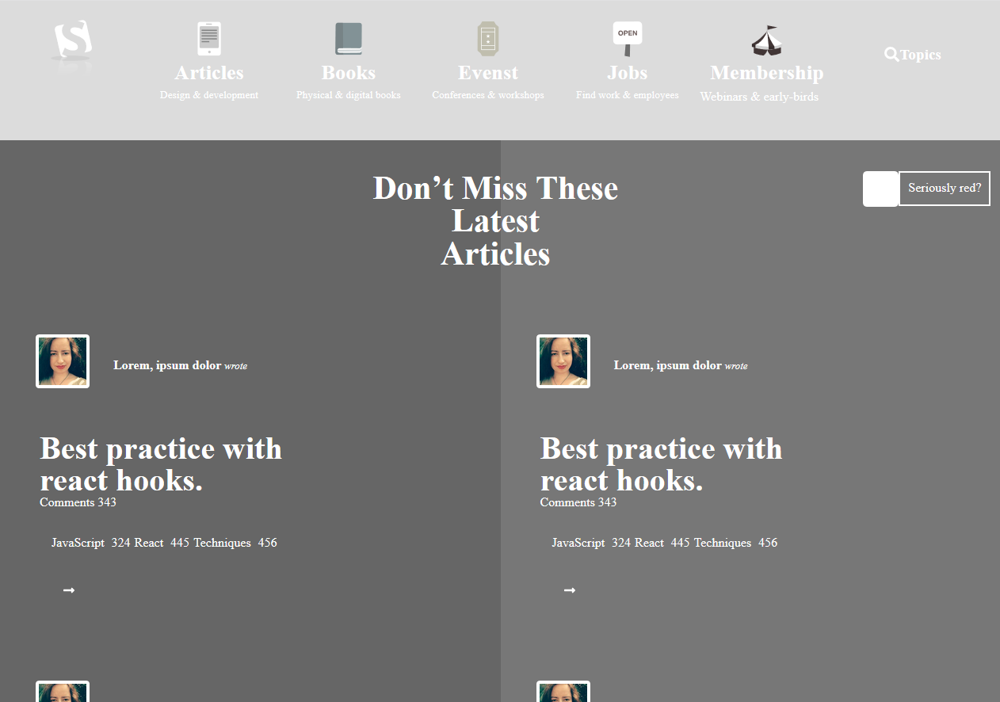

# Project Name

    In this project try to create a grayscale heat map of the website that indicates which elements have the greatest weight in the visual hierarchy.

    Additional description about the project and its features.

## Built With

    - Plain HTML5,
    - Pure CSS3,

## Live Demo

[Live Demo Link](https://rawcdn.githack.com/mcervantes71/Smashing_Megazine_Clone/tree/feature_branch/index.html)

## Getting Started

    To get a local copy up and running follow these simple example steps.

### Install

    Download the repository

### Usage

    In any browser, open the index.html file

## Authors

👤 **Author1**

- Gmail: [Martin Cervantes](mailto:cervantes.martine@gmail.com)
- Github: [@mcervantes71](https://github.com/mcervantes71)
- Twitter: [@M4rt1nC3rv4nt3s](https://twitter.com/M4rt1nC3rv4nt3s)
- Linkedin: [Martin Cervantes](https://www.linkedin.com/in/cervantesmartin/)

👤 **Author2**

- Gmail: [Gabriel Hilarion](mailto:gabrielhilarion@gmail.com)
- Github: [@gabrie-lHilarion](https://github.com/gabrie-lHilarion)
- Twitter: [@gabrielDeman](https://twitter.com/gabrielDeman)
- Linkedin: [Gabriel Hilarion](https://www.linkedin.com/in/gabrielhilarion/)

## 🤝 Contributing

    Contributions, issues and feature requests are welcome!

Feel free to check the [issues page](../../issues).

## Show your support

    Give a ⭐️ if you like this project!

## 📝 License

This project is [MIT](lic.url) licensed.
